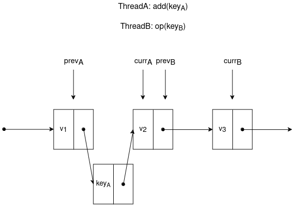

## Question1:

The set data type using linked lists with optimistic synchronization is implemented in `OptiSet.java` and `Node.java`.

## Question2:

#### a)

The code for deleting a code is as following:

```java
    public boolean remove (int key) {
        while (true) {
            Node prev, curr;
            prev = this.content;
            curr = prev.next;
            
            while (curr.key < key) {
                prev = curr;
                curr = curr.next;
            }
            // some other threads may make validate() fail
            prev.lock.lock();
            curr.lock.lock();
            
            try {
                if (validate(prev, curr)) {
                    if (curr.key == key) {
                        prev.next = curr.next;
                        return true;
                    }
                    return false;
                }
            } finally {
                prev.lock.unlock();
                curr.lock.unlock();
            }
        }
    }
```

A thread which attempts to delete a node forever is a thread whose `validate()` method never succeeds.

If in each loop, after the thread has found a node with key greater or equal than the searched key and before the thread locks the two locks (see the position of the comment), a thread deletes and readds the nodes which make `validate()` fail, then the thread is forever attempting to delete a node.

#### b)

Yes, it only needs to lock $prev$.

Suppose the `add()` method locks only $prev$, we keep the linearization points of the original `add()`, `remove()` and `contains()` methods, that is the time point at which validation succeeds. We next show the linearizability of this implementation by comparing it to the original implementation.

The only case where this implementation differs from the original one is when the $curr$ node during an `add()` execution may be locked by another concurrent thread. That is we have:


We show this case will not lead to a violation of linearizability. First, we have $key_{A} \leq v_{2} < key_{B}$, thus $key_{A} \neq key_{B}$. Thus every possible combinations of the return values of the two threads will not result in non-linearizability for every possible order (there are two) of linearization.

We next show the two operations left the list in desired representation. We know that right after the linearization points, the corresponding nodes exist in the list at least until the release of locks. $Thread_{A}$ will either modify $prev_{A}.next$ and return $true$ (shown in figure below) or return $false$ without modifying anything. No matter what operation $Thread_{B}$ performs, only $prev_{B}.next$ may be modified. Consequently, they do not interfere with each other and can be think of both left the list in desired representation after their linearization point.



We can have `add()` method locking only $prev$.

#### c)

This alternative is linearizable.

We keep the linearization points of `add()` and `remove()`. The linearization point of a successful execution of `contains(key)` can be defined as the earlier time point in the interval of method execution between:

- the time point when the method observes `key`.
- the time point right before the observed node gets removed from the list by `remove()`.

And the linearization point of a unsuccessful execution of `contains()` can be defined as the earlier time point in the interval of method execution between:

- the time point when the method observes two consecutive nodes with keys strictly smaller and bigger than `key`.
- the time point right before a node with `key` gets added in the list by `add()`.

If we keep the original linearization point of `contains(key)` without lock, the node with `key` may be removed or added after `key` has been observed or denied existence, respectively, thus violating linearizability. The proposed linearization policy moves such linearization points before the source of non-linearizability, thus guaranteeing linearizability.

## Question3:

The set data type using linked lists with lazy synchronization is implemented in `LazySet.java` and `LazyNode.java`.

## Question4:

#### a)

The algorithm remains linearizable if we mark a node as removed simply by setting its next field to $null$. However, it's simply because the initial state is empty set and we can no longer have terminating `add()` and `remove()` operations on an empty set.

It is because we are unable to distinguish between a logically deleted node and the last node in the list. Especially, when we try to perform `add()` and `remove()` on an empty list, the method `validate()` will fail.

`ex4a1.java` shows such scenario. Checking for $null$ fields during list traversal is not implemented because it's not useful for demonstration purpose.

If in the definition of set, the initial state is not an empty set, then the implementation is not linearizable. It is because the method `contains()` may not observe the desired value if the list is temporarily truncated by `remove()`.

Below shows a counterexample generated using `ex4a2.java`, the set has initial state $\{ 1, 2, 3 \}$.

```
t1: call@1 contains(3)
t1: rtn@2 contains(3, false)

t2: call@0 remove(2)
t2: rtn@3 remove(2, true)
```

#### b)

The validation method cannot be simplified by dropping the check that $prev.next$ is equal to $curr$.

Because nodes may be added between $prev$ and $next$ after the matching nodes have been found but the locks have not yet been acquired.

Below shows a counterexample generated using `ex4b.java`:

```
t2: call@1 add(1)
t2: rtn@3 add(1, true)

t1: call@0 add(1)
t1: rtn@2 add(1, true)
```

#### c)

Locking only the $prev$ or only the $curr$ in `remove()` are not linearizable.
 
The linearization point for a success execution of `remove()` should always be the time when the tag is marked. If only one lock is acquired, no matter which one, we would have two adjacent `remove()` operations taking place concurrently:


Assume the two `remove()` have found their matching nodes $v_{2} = key_{A}$ and $v_{3} = key_{B}$, and they both "waited" for each other to pass validation before modifying anything. The two threads' field modifications may then overlap, pretty much the same as in fine-grained synchronization:


The node of value $v_{3}$ would not be deleted. Thus these implementations are not linearizable. Below shows a counterexample generated using `ex4c1.java`, which only locks $prev$:

```
t1: call@0 add(1)
t1: rtn@2 add(1, true)
t1: call@3 remove(1)
t1: rtn@6 remove(1, true)

t2: call@1 add(2)
t2: rtn@4 add(2, true)
t2: call@5 remove(2)
t2: rtn@7 remove(2, true)

Set elements: { (key: -2147483648, tag: false) (key: 2, tag: true)
    (key: 2147483647, tag: false) }
```

Another counter example generated using `ex4c2.java`, which only locks $curr$ (the same as the previous one):

```
t1: call@0 add(1)
t1: rtn@2 add(1, true)
t1: call@3 remove(1)
t1: rtn@6 remove(1, true)

t2: call@1 add(2)
t2: rtn@4 add(2, true)
t2: call@5 remove(2)
t2: rtn@7 remove(2, true)

Set elements: { (key: -2147483648, tag: false) (key: 2, tag: true)
    (key: 2147483647, tag: false) }
```

#### d)

The implementation is linearizable if we drop the physical deletion and only perform logical deletion.

This is because a logically deleted node would forever occupy the place and block the validation. Thus any subsequent operations with one of the matching nodes marked will never return. In other words, after a `remove()` operation, any further operation with the same key will never return. This gives the freedom to choose linearization points and return values. The implementation is thus linearizable.

`ex4d.java` shows such scenario.
